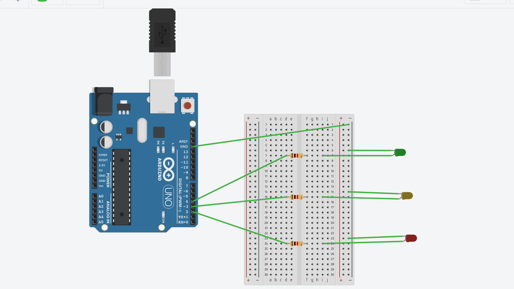
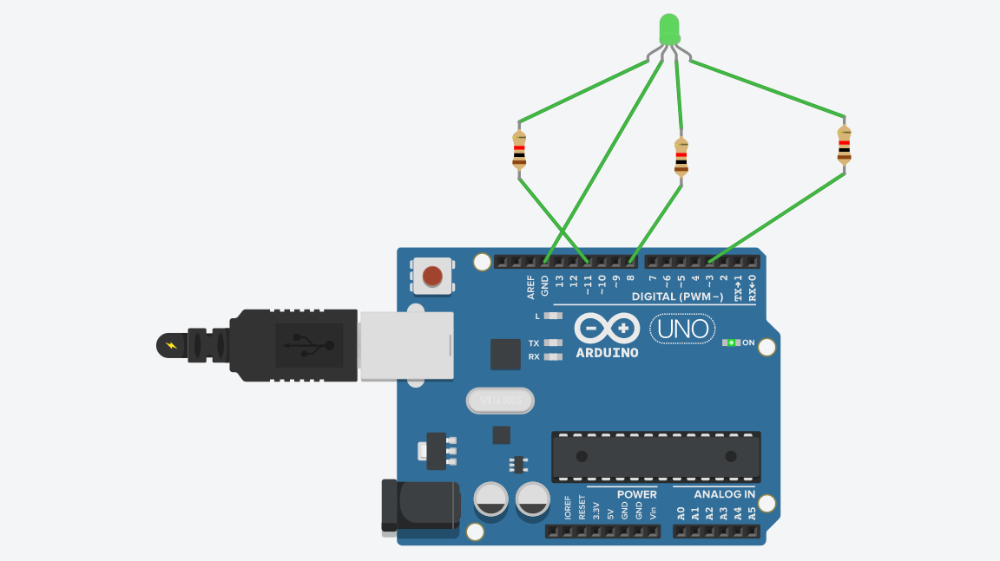
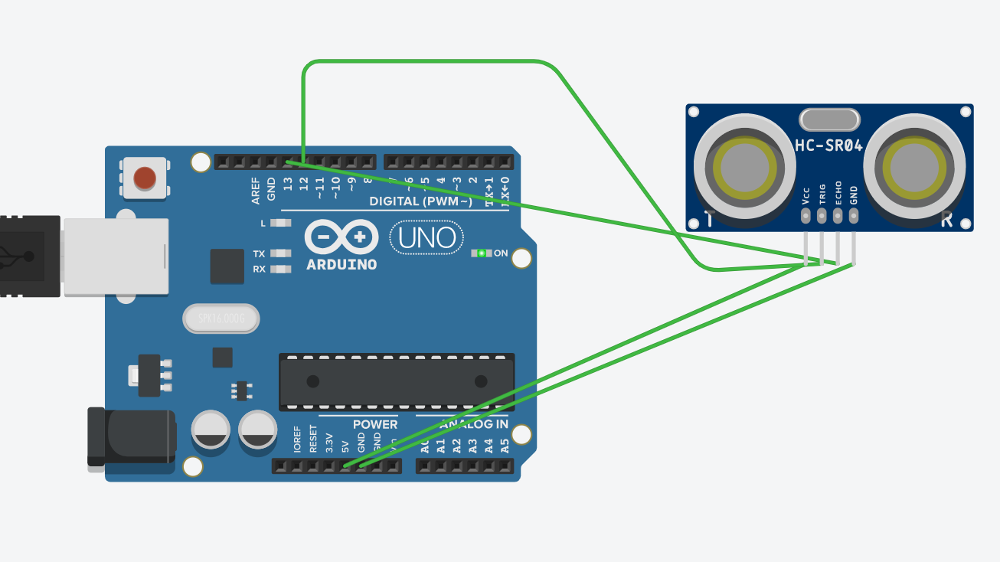
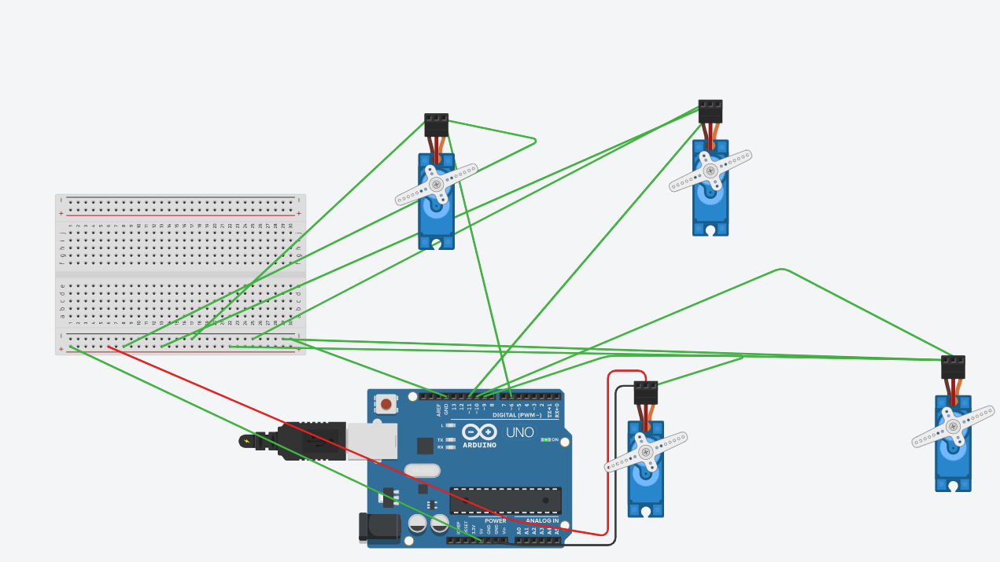

# IOT for Industries
In this I have implemented basic iot Projects using Arduino

 # 1. Stimulation of play Music:

Screenshots
-----------

#  2.Traffic Light System

#  3.Arduino using RGB led 

#  4. Ultrasonic Sensor with Arduino

#  4. Servo Motors with Arduino

